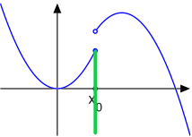
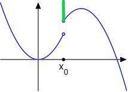

- ## 定义 ##

1. **度量/伪度量**
>(i) 三角不等式：$d(x,z)\le d(x,y)+d(y,z)$
>(ii) 对称性：$d(x,y) = d(y,x)$
>(iii) 规范性：$d(x,x) = 0$
	则称$d$是一个伪度量
> (iv) 分离性：若$d(x,y) = 0$，则$x=y$
	则称其为一个度量
2. **网的收敛/Cauchy网**
3. **开球/闭球/球面/开集/闭集/闭包/内部/边界/聚点**
4. **度量空间中集合的直径**
>$E\subseteq X, diam E = \sup d(x,x'), x,x'\in E$
5. **子空间**
6. **紧集**
7. **半范数/范数**
>(i) 绝对齐次性：$\sigma(cx) = |c|\cdot\sigma(x)$
(ii) 次加性：$\sigma(x_1+x_2) \le \sigma(x_1) + \sigma(x_2)$
则称$\sigma:X\to\mathbb{R}$是一个半范数
(iii) 分离性：$\sigma(x) = 0$，then $x = 0$
则称其是个范数
8. **级数可和**
9. **连续映射/一致连续/Lipshitz映射/等距映射**（渐强）
> 例：令$A:V[a,b]\to L^1[a,b],f\mapsto f'$，$A$为Lipschitz映射；且$f$为绝对连续函数时，$A$为等距映射
10. **线性集（线性子空间）**
11. $span A = \cap\{线性集L | L\supseteq A\} = \{\sum_{i=1}^n c_ix_i | n\ge 1, c_i\in\mathbb{C}, x_i\in A\} = 包含A的最小线性集$
12. **凸集**
> 若$C$凸，则$(c_i\ge 0, \sum_{i=1}^n c_i = 1)\wedge(x_i\in C) \Rightarrow \sum_{i=1}^n c_i x_i \in C$
13. $cux A = \cap\{凸集C | C\supseteq A\} = \{\sum_{i=1}^n c_i x_i | n\ge 1,c_i\in\mathbb{C},c_i\ge 0, x_i\in A, \sum c_i =1\}$
14. **数值函数在孤立点/聚点的上下极限**
15. **上半连续/下半连续**
> 称$f$在$x_0$上半连续$\iff \overline{\lim}_{x\to x_0} f(x)\le f(x_0)$
称$f$在$x_0$下半连续$\iff f(x_0)\le\underline{\lim}_{x\to x_0} f(x)$
16. **振幅**
> 对于映射$A : (X,d)\to (Y,d)$，令$w(S) = \sup\{d(Ax_1,Ax_2) | x_i\in S\}$，这是$A$在$S$上的振幅；令$w(x) = \inf_{r>0} w(o(x,r))$
17. **距离诱导的函数**
> 在$(X,d)$中，点$x$到子集$A$有距离：$$d(x,A) = \inf\{d(x,y)|y\in A\}$$ 约定$d(x,\empty) = +\infty$
18. **最佳逼近**
> 若有个$x_0\in A$，使得$d(x,x_0) = d(x,A)$，则称$x_0$是$A$对于$x$的一个最佳逼近。
19. **次线性泛函**
> 设$\sigma:X\to\mathbb{R}$，则$\sigma$若满足：
（1）$X$是数域$\mathbb{C}$上的线性空间；
（2）$\sigma(ax) = a\sigma(x) ,\forall a\ge 0$ 注意，这里对$a<0$的情况没有要求。
（3）$\sigma(x_1+x_2)\le\sigma(x_1) + \sigma(x_2)$ （从而可自然得出：$\{\sigma\ge c\} , \{\sigma < c\}$是凸集）
则称$\sigma$是个次线性泛函。
20. **有界**
> 称$A$有界，指$dim A < +\infty \iff \exist x_0\in X, r_0\in[0,+\infty) , A\subseteq o(x_0,r_0)$
21. **$\epsilon-网$**
> 称$F\subseteq X$是$A$的$\epsilon-$网 $\iff A\subseteq \cup_{x\in F}o(x,\epsilon) $

- ## 例子 ##

- 函数$f:M\to\mathbb{E}$全体$\mathbb{E}^M$上有**伪度量**：$$d_t:(f,g)\mapsto|f(t)-g(t)| (t\in M)$$ 不满足分离性；刻画了*点态收敛*。
- （**一致模**）对于函数$f\in\mathbb{E}^M$（此时函数可取♾），取一致模（此时其不为范数，因范数不可取无限）$\|f\| = \sup|f|(M)$，定义度量：$$d:(g,h)\mapsto\|g-h\|\wedge 1$$是度量空间，刻画了*一致收敛*；当$f$有界时，上述一致模为范数，上述空间为*赋范空间*。
- （**本质最大模**）测度空间上可测函数$f:M\to \mathbb{E}$上有本质最大模：$$\|f\|_\infty = \min\{c\in[0,+\infty] | \mu(|f|>c) = 0\}$$在$L^\infty(M,\mu)$空间上依此范数成为Banach空间。（$l^\infty$同理）
- （**$L^p$-模**）测度空间上可测函数$f:M\to\mathbb{E}$上定义**$L^p$-模**：$$\|f\|_p = (\int_M |f(x)|^p\mu(dx))^{1/p}:0<p<+\infty$$在$L^p(M,\mu)$空间上依此范数成为Banach空间。（$l^p$同理）
- **有界变差函数**全体$f:T\to\mathbb{E}$全体$V(T)$上有范数：$$\|\cdot\|_V:f\mapsto|f(\star)| + V(f,T)$$其中$\star = a$或$\star = a+$各表示$a$属于$T$和$a$不属于$T$。则，
	1. $V(T)$依此范数成为Banach空间；
	2. 在开区间(a,b)右连续、$f(a) = 0$的$f\in V[a,b]$全体$V_0[a,b]$依此范数成为Banach空间，此时范数$\|f\|$等于全变差$V_a^b(f)$
	3. 绝对连续函数$f:[a,b]\to\mathbb{E}$全体$AC[a,b]$依次范数成为Banach空间；
	4. $AC[a,b]$的线性集$AC_0[a,b] = \{f\in AC[a,b] | f(a ) = 0\}$依此范数也是Banach空间
- **（空间$C^{(k)}[a,b]$）** 设具有连续$k$阶导数的函数$x(t)$全体记为$C^{(k)}[a,b]$，定义**度量**：$$\rho_k(x,y) = \max_{0\le j\le k}\max_{a\le t\le b}|x^{(j)}(t) - y^{(j)}(t)|$$ 从而其刻画了$\{x_n(t)\}$以及其前$k$阶导函数列在$[a,b]$上都分别均匀收敛于$x(t)$及其前$k$阶导函数。
- **（空间$C[a,b]$）** 设$C[a,b]$设$[a,b]$上连续函数全体所成的线性空间，定义范数$$\|f\| = \max_{x\in[a,b]}|f(x)|$$ 则其是一个**Banach空间**
- **（空间$L[a,b]$）** 设$L[a,b]$是区间$[a,b]$上Lebesgue可积函数全体所成的线性空间，定义半范数$$p(f) = \int_a^b|f(t)|dt$$ 【注意】：
	1. 是半范数，不是范数；
	2. 而将其限制在$C[a,b]$上时成为范数，但不完备；
	3. 其在商空间的意义下成为范数（$f(t) = g(t)$a.e.）；此时其是**Banach空间**（$p\ge 1$时均完备）。
- **（空间$l^\infty$）** 设$l^\infty$是有界实/复数列全体所成的线性空间；定义范数：$$\|x\| = \sup_i|x_i| , x=(x_1,x_2,...,x_n,...)$$
- **空间$A^p(M)$** 令$A^p(M) = \{全纯f:M\to\mathbb{C} | \|f\|_p<+\infty\}$，则$A^p(M)$是个Banach空间。
- $$l^\infty = \{(x_n)_{n\ge 1} | x_n\in\mathbb{C}, \|x\|_\infty = \sup_{n\ge 1} |x_n|<+\infty\}$$ 上面有个次线性泛函：$$x\mapsto\overline{\lim}_{n\to\infty} re(x_n)$$

- ## 性质/结论 ##

- ### 1. 度量空间 ###

***1.1*** 	**收敛网是Cauchy网，但反之不然**
> 反例：在$(\mathbb{Q},d)$中，令$d(x,y) = |x-y|$，设$$\sqrt{2} = 0.a_1a_2...a_n...$$（10进制），令$$x_n = 0.a_1a_2...a_n$$ 则$\{x_n\}$是Cauchy列，但于$\mathbb{Q}$不收敛。

***1.2*** 	**度量空间中完备的等价条件**
	对于$(X,d)$，以下条件等价：
	1. $X$中Cauchy**网**$(x_i)_{i\uparrow\beta}$都收敛，此时称$X$【完备】空间
	2. $X$中Cauchy**序列**$(x_n)_{n\ge 1}$都收敛，称$X$【序列完备】空间
	3. $X$中满足$\sum_{n\ge1}d(x_n,x_{n+1})<+\infty$的序列$(x_i)$都收敛
	4. $X$中直径趋于0的闭集套$(E_n)_{n\ge 1}$有公共点
> $(1)\iff (2)\iff (3) ; (2)\iff (4)$
> Hint:$d(x_n,x_m)\le diam E_n$

***1.3*** 	 **紧集的等价条件**
	对于$A\subseteq (X,d)$，以下条件等价：
	1. $A$的开覆盖$\mathscr{F}$都有有限个子覆盖$\mathscr{F}_0$
	2. $A$（子空间）中有限交的闭集族$C_C$有公共交点
> Rudin

***1.4*** 	**在度量空间中，$\{紧集\}\subseteq\{完备集\}\subseteq\{闭集\}$**

***1.5***	设$d_j(j\in\gamma)$是$X$上可数个伪度量，设$c_j>0$，且$\sum_{j\in\gamma}c_j<+\infty$。令$d(x,x') = \sum_{j\in\gamma}c_j\wedge d_j(x,x')$。则$d$是个伪度量且$$\lim_{i\uparrow\beta} d(x_i,x)=0 \iff \forall j\in\gamma, \lim_{i\uparrow\beta}d_j(x_i,x) = 0$$

- ### 2. 赋范空间 ###

***2.1*** 	赋范空间是度量空间

***2.2*** 	$\|\cdot\| : X\to \mathbb{R}$是Lipschitz函数

***2.3*** 	**给定$X$上两个范数$\|\cdot\|_1, \|\cdot\|_2$，以下条件等价：**【此时也称$\|\cdot\|_1$弱于$\|\cdot\|_2$】
		（1）$(X,\|\cdot\|_1)$中开集/闭集都是$(X,\|\cdot\|_2)$中开集or闭集
		（2）有个常数$c\in[0,+\infty)$恒使$\|x_1\|\le c\|x_2\|$
		（3）恒同映射$1:(X,\|\cdot\|_1)\to(X,\|\cdot\|_2)$是开映射or闭映射
		（4）恒同映射$I : (X,\|\cdot\|_2)\to(X,\|\cdot\|_1)$是连续映射
> （(1) to (2)：$\|x\|_2<r \Rightarrow \|x\|_1<1 $；接下来有$\|\frac{rx}{\|x\|_2+s}\|<r $）
> **【推论】**：$(X,\|\cdot\|_1)$和$(X,\|\cdot\|_2)$有相同范数拓扑
$\iff \|\cdot\|_1 ,\|\cdot\|_2$等价
$\iff \exist c_1,c_2\in(0,+\infty), \forall x\in X, c_1\|x\|_1\le\|x\|_2\le c_2\|x\|_1$ 
此时，$(X,\|\cdot\|_1)$完备$\iff (X,\|\cdot\|_2)$完备

***2.4*** 	**事实：无限维空间$X$上至少有$\aleph$个相互不等价的范数**
> 令$\|x_\alpha\|_p = (\sum_{i\in\gamma}(x_\alpha)_i^p)^{1/p}$，其中$x_\alpha(i) = \chi_\alpha$

***2.5*** 	设$(X_1,\|\cdot\|_1)$和$(X,\|\cdot\|_2)$是赋范空间，令$X_1\times X_2$为$X_1,X_2$的笛卡尔积，规定$$\|(x_1,x_2)\|_p = (\|x_1\|_1^p + \|x_2\|_2^p)^{1/p} , 1\le p<+\infty $$ $$ \|(x_1,x_2)\|_p = \max\{\|x_1\|_1,\|x_2\|_2\} , p = \infty$$ 则这些范数相互等价
> Hint: $X_1\times X_2 \to_\phi \mathbb{R}\times\mathbb{R}\to_{l^p}\mathbb{R}$；前者为固定函数；后者为二维线性空间上的范数。

***2.6*** 	在赋范空间$(X,\|\cdot\|)$中,
		(1) 线性集$L$的闭包$\overline{L}$是线性集，凸集$C$的闭包$\overline{C}$是凸集。
		(2) 线性集$L$有个内点$x_0$时，$L = X$
		(3) 凸集$C$有个内点$x_0$时，$\overline{C^0} = \overline{C}$
> Hint: （1）用序列的极限来证明；（2）考虑集合$o(x_0,r)-x_0$，从而有$\forall x\in X,\|\frac{rx}{\|x\|+1}\|<r , x = \frac{\|x\|+1}{r}\cdot\frac{rx}{\|x\|+1}\in L$

- ### 3. 数值函数 ###

***3.1*** 	若$f$在$x_0$取得局部最大值（即$\exist r>0 : d(x,x_0)<r时，有f(x)\le f(x_0)$），$则f在x_0上半连续$
***3.2*** 	若$A\subseteq X , \chi_A$在$x\in A$上半连续，在$x\in X\backslash A$下半连续
***3.3*** 	设$f:X\to\overline{\mathbb{R}}$，则$f$在诸点$x\in X$上半连续$\iff \forall b\in\mathbb{Q}或\mathbb{R}$，$\{f<b\}$是开集，$\{f\ge b\}$是闭集【下半连续时同理】
 下半连续 上半连续
> Hint: 任取$x_0\in\{f<b\}$，**而$\overline{\lim}_{x\to x_0}f(x)\le f(x_0)$意味着存在$r>0$，使得$d(x,x_0)<r$时，$f(x)<b'$（其中$f(x_0)\le b'\le b$）**

***3.4*** 	振幅函数$w:X\to\overline{\mathbb{R}}$上半连续，且$A$在$x$连续$\iff w(x) = 0$
【从而，$w(x)$是$A$在$x$的连续性障碍】
x
***3.5***	设$(X,\|\cdot\|)$是个赋范空间，$\sigma:X\to\mathbb{R}$是个次线性泛函，则以下命题等价：
（1）$\sigma$在原点$o \in X$上半连续：$\overline{\lim}_{x\to0}\sigma(x)\le\sigma(0)$（此时$\sigma$一致连续）
（2）$\sigma$将$X$中有界集$S$映为有界集$\sigma(S)$。这里$S$有界指$\sup_{x\in S} \|x\| < +\infty$
（3）有个$c\ge 0$，使得$\|x\| < 1$时，$\sigma(x)\le c$，此时$|\sigma(x_1) - \sigma(x_2)|\le c\|x_1 - x_2\|$

***3.6***	令$C_bM = \{f\in l^\infty M | f连续\} , C_0M = \{f\in C_bM | \lim_{x\to\infty}f(x) = 0\}$ , 则$C_bM, C_0M$是线性集也是闭集，进而$(C_bM,\|\cdot\|_\infty) , (C_0M,\|\cdot\|_\infty)$均完备

***3.7***	设线性集$L\subseteq X$，商空间$X/L = \{[x] | x\in X\}$，在其上赋予范数：$$\|[x]\| = d(x,L) = d(x,\overline{L})$$，则：
（1）首先，$\|[x]\|$是$X/L$的一个半范数；
（2）$\|[x]\|$是范数$\iff L$是闭集
（3）设$L$是$(X,\|\cdot\|)$的线性闭集，则$L$和$X/L$都完备$\iff X$完备

***3.8***	有限个赋范空间$(X,\|\cdot\|_1),...,(X,\|\cdot\|_n)$的乘积空间$X_1\times...\times X_n$还是赋范空间，其中$$\|(x_1,...,x_n)\| = (\sum_{i=1}^n \|x_i\|_i^p)^{1/p}$$ 而可列个情形是赋范准空间

- ### 4.列紧性 ###

***4.1***	**（Bolzano - Weierstrass定理）** 在$\mathbb{R}^n$中，有界序列有收敛子列。

***4.2***	在$(X,d)$中，子集$A$的任何序列$(x_n)_{n\ge 1}$都有Cauchy子列$\iff$ 对于任何$\epsilon>0 , A$有个有限$\epsilon-$网$F$。此时称$A$是个完全有界集，也称为预紧集。此时可要求$F\subseteq A$

***4.3***	在$(X,d)$中，关于子集$A$的以下条件等价：
（1）$A$中序列$(x_n)_{n\ge 1}$都有收敛子列$(x_{k_n})_{n\ge 1}$
（2）$A$是完全有界集，且其闭包$\overline{A}$是完备集
（3）$\overline{A}$是紧集，此时称$A$是个相对紧集。

- ## 定理 ##

***1.*** **Heine-Cantor定理：伪度量空间之间的连续映射$A:(X,d)\to(Y,d)$在$X$紧时一致连续**
> Hint:通过紧性，找开球半径的最小值

***2.*** **Banach不动点原理（压缩映射原理）：设$(X,d)$是个完备度量空间，$A:X\to X$是个压缩映射，即$\exist q\in[0,1), \forall x_1,x_2\in X: d(Ax_1,Ax_2)\le qd(x_1,x_2)$.那么，$A$有唯一不动点$x_0$，它是诸$x\in X$的迭代序列$(A^nx)_{n\ge 0}$的极限，且$d(A^nx,x_0)\le q^nd(x,Ax)/(1-q)$**
> Hint: 1. 计算$\sum_{k\ge 1} d(A^{k-1}x,A^kx)<\infty$；2. 证明不动点唯一；3. 计算$d(A^nx,x_0)$

> **【推论】**：**渐进压缩函数**$T:X\to X$也有唯一不动点（即，$\exist k: T^k:X\to X$为压缩映射）

***3.*** **Minkowski定理：有限维线性空间上，任何两个范数等价（且完备）**
> Hint: 与欧几里得范数作比较：1. $\|x\| = \|\sum_1^n t_ie_i\|\le\sum_1^n|t_i|\cdot\|e_i\|\le\sqrt{\sum_1^n|t_i|^2}\cdot\sqrt{\sum_1^n\|e_i\|^2} = b|x|$ 2.将$\|\cdot\|$限制在欧几里得空间的单位球面上，利用紧集上非负函数有最小值的性质

***4.*** **极值定理：在上半连续条件下，$f$限制于紧集$T$上有最大值。【等价于可数紧】**
> Hint: 设$b_0 = \sup f(X)$，考虑有理数列$b_n\uparrow b_0$，则$\{f\ge b_n\}$为一递减的闭集套，其交非空，即为最大值。

***5.*** **Dini定理：设$(f_i:X\to\mathbb{R})_{i\uparrow\beta}$是紧空间上、上半连续函数网，且逐点递减收敛到0，则$f_i$一致逼近0**
> Hint: $\forall\epsilon>0,令B_i = \{f_i<\epsilon\}$，则$B_i$是一列递增的开集，且覆盖$X$。

>【**推论**】：上述$f_i$都连续，且逐点递减收敛到连续函数$f$时，$f_i$一致逼近$f$

- ## 题目 ##

- ### 1. 度量空间 ###

***1.1*** 	考察积分方程：$$g(x) = f(x) + \int_a^x h(x,y)g(y)dy$$ 其中$h$是$\triangle = \{(x,y) | a\le x\le b, a\le y\le x\}$上连续函数。已知$f:[a,b]\to \mathbb{C}$连续，而$g:[a,b]\to\mathbb{C}$为未知连续函数。
> Hint: 令$(Tg)(x) = f(x)+\int_a^xh(x,y)g(y)dy$；则方程有解$\iff Tg = g$有解，即$Tg$有不动点；计算$$|(Tg_1 - Tg_2)(x)|,|(T^2g_1 - T^2g_2)(x)|,...,|(T^kg_1 - T^kg_2)(x)|$$

- ### 2. 数值函数 ###

***2.1*** 	**如何刻画各阶偏导数内闭一致收敛？** 设$M\subseteq\mathbb{R}^n$为开集，$M$上光滑函数网$(f_i)_{i\uparrow\beta}$各阶偏导数内闭一致收敛至$f$指$$\forall p=(p_1,...,p_n)\in\mathbb{N}^n,\forall\text{紧集}A\subset M,\partial^pf_i在A上一致收敛至\partial^pf$$ 其中$$(\partial^pf)(x) = \frac{(\partial^{p_1+...+p_n})(x)}{\partial x_1^{p_1}...\partial x_n^{p_n}}$$
> Hint: 令$A_k = \{x\in\mathbb{R}^n | |x|\le k, d(x,\mathbb{R}^n\backslash M)\ge 1/k\}$

- ### 3. 赋范空间 ###

***3.1***	$M\subseteq\mathbb{C}$为开集，$f:M\to\mathbb{C}$为全纯函数，则：$$|f(z)|\le\frac{\|f\|_p}{(\pi d(z,\mathbb{C}\backslash M)^2)^{1/p}}$$
> Hint: 1. 由**圆周上的均值公式**，知$$f(z) = \int_{|w-z| = r} f(w)\frac{|dw|_1}{2\pi r}$$2. 可推出**圆盘上的均值公式**：$$\int_{B(z,r)}\frac{f(w)|dw|_2}{\pi r^2} = f(z)$$ 3. 利用Holder公式即证

***3.2***	$A^p(M)$是个Banach空间。
> Hint: 1. 由3.1知，任取$A^p(M)$中的Cauchy列$(f_n)$，有$$|f_n(z) - f_m(z)|\le\frac{\|f_n-f_m\|_p}{(\pi d(z,\mathbb{C}\backslash M)^2)^{1/p}}$$ 从而$|f_n(z) - f_m(z)|$也是一个Cauchy列；由复平面的完备性，存在一个函数$f:M\to\mathbb{C}$，使得$\lim_n f_n(z) = f(z),\forall z\in M$
> 2. 证明$f$全纯，只需证明$f_n$在$M$上内闭一致收敛于$f$即可。为此，任取紧集$A\subseteq M$,有$$|f_n(z) - f_m(z)|\le\frac{\|f_n - f_m\|_p}{(\pi r^2)^{1/p}}$$ 其中$r = \min(d(z,\mathbb{C}\backslash M))$ （由紧性保证了可达）
> 3. 证明$\|f\|_p<+\infty, \|f_n - f\|_p \to 0$。由条件，$\int_M |f_n(z) - f_m(z)|^p |dz|_2 \le \epsilon^p$，由Fatou引理：$$\int_M\underline{\lim}_{m\to\infty} |f_n(z) - f_m(z)|^p |dz|_2 \le \underline{\lim}_{m\to\infty}\int_M |f_n(z) - f_m(z)|^p |dz|_2 \le \epsilon^p$$ 从而有$\|f_n -f \|\le \epsilon , \|f\|_p < +\infty$。

